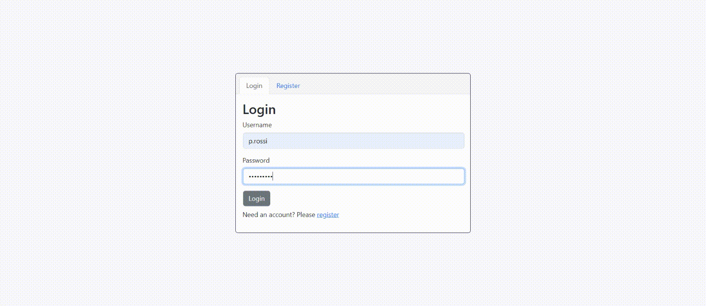
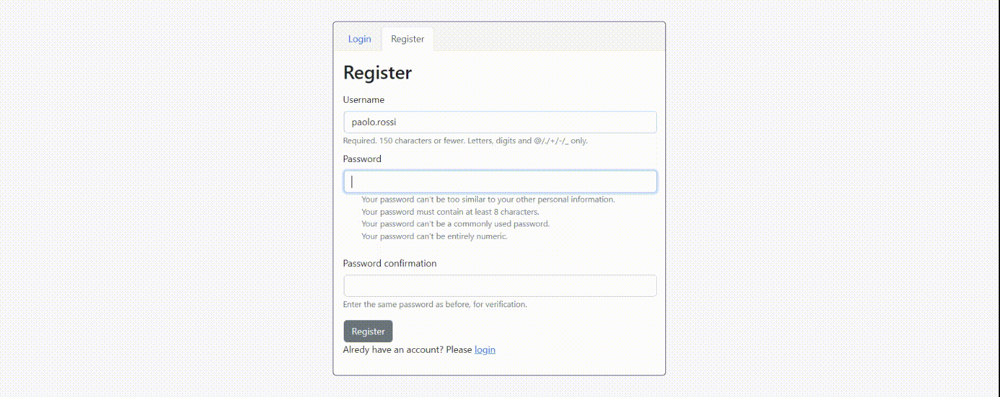
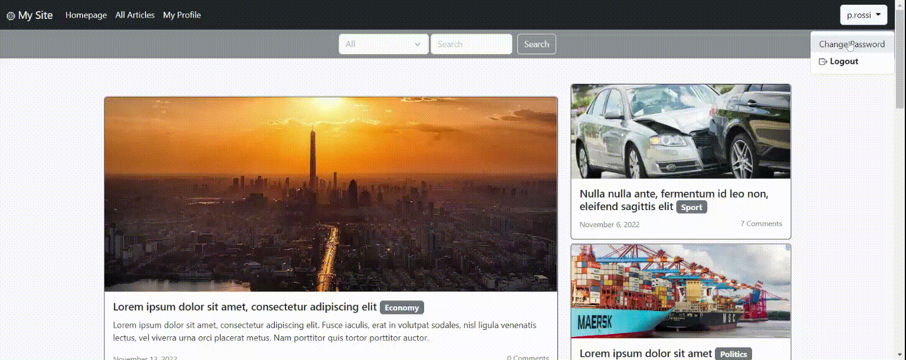
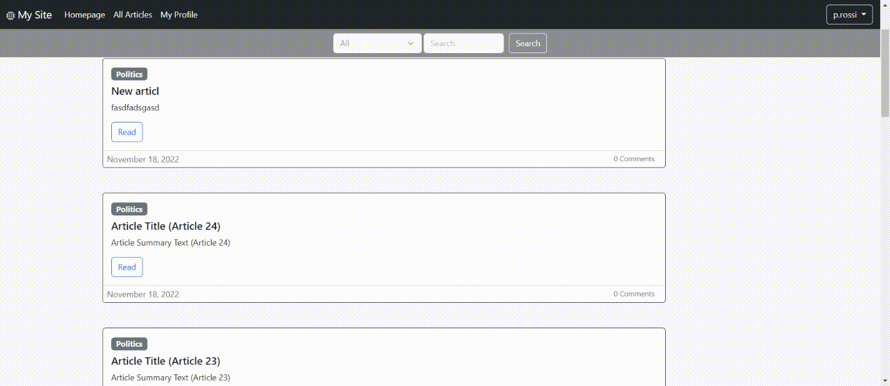
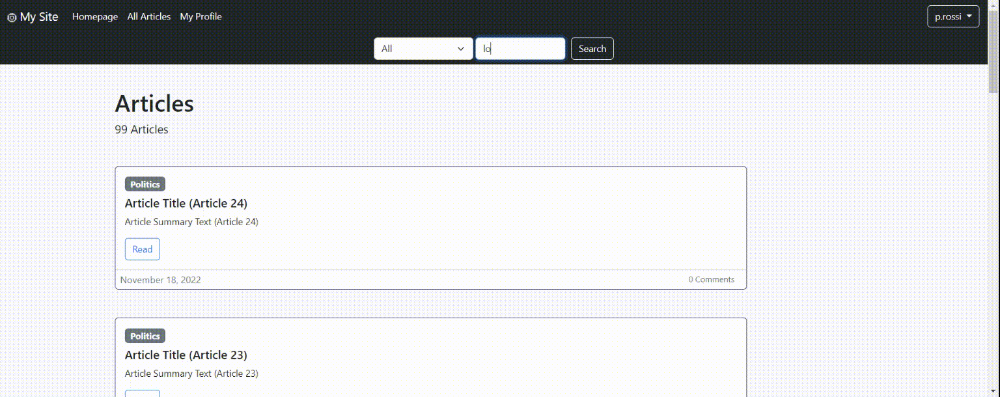

<h1> Overview </h1>
 &nbsp;&nbsp;&nbsp;&nbsp;
 &nbsp;&nbsp;&nbsp;&nbsp;

A simple articles web application built with <b>django + htmx + Bootstrap</b>.

<h1>Installation</h1>
<ol type="1">
  <li> Clone git repository </li>
  <pre><code>$ git clone https://github.com/stefanoandroni/mysite-django </code></pre>
  <li> <em>(Optional)</em> Create a Python virual environment and activate it (py version in <em>runtime.txt</em>)</li>
  <li>Install requirements</li>
  <pre><code>$ cd mysite-django</code></pre>
  <pre><code>$ pip install -r requirements.txt</code></pre>
  <li>Change directory to src</li>
  <pre><code>$ cd src</code></pre>
  <li>Make migrations and migrate</li>
  <pre><code>$ py manage.py makemigrations</code></pre><pre><code>$ py manage.py migrate</code></pre>
  <li>Run server</li>
  <pre><code>$ py manage.py runserver</code></pre>
</ol>
<em><b>Note</b> Change DJANGO SECRET_KEY in .env for production</em>

<h1>Note</h1>
To use all features is highly recommended to:
<ol type="1">
  <li> Create an admin user </li>
  <pre><code>$ python manage.py createsuperuser </code></pre>
  <li> Register as a user in <code>'/accounts/register'</code> and login </li>
</ol>
Only registered users will be able to use the functions of the web application. Furthermore, only an administrator can decide which articles to insert on the homepage (front page).

<h1>Django applications</h1>

'mysite' is the project root directory.

<em><b>Note</b> The endpoints for htmx requests (not accessible) and for static files are not included</em>
<h2>Edpoints</h2>
<h3>accounts </h3>
<pre>
/accounts /login
          /logout
          /register
          /password-change
</pre>
<h3>articles</h3>
<pre>
/articles /                                             
          /create                             <em>Create</em>
          /list                               <em>Retrieve (List)</em>
          /&lt;slug:article_slug&gt;  /             <em>Retrieve (Detail)</em>
          /&lt;slug:article_slug&gt;  /update/      <em>Update</em>          
          /&lt;slug:article_slug&gt;  /delete/      <em>Delete</em>
</pre>
<h3>profiles</h3>
<pre>
/profiles /
</pre>
<h3>search</h3>
<pre>
/articles /search
</pre>
<h2>Features</h2>
<h3>accounts </h3>
  
  
  
<h3>articles</h3>
   
   
   
<h3>profiles</h3>
   
<h3>search</h3>
   

<h1> Some implementation notes </h1>
<ul>
<li>Views were initially implemented as <b>FBV (Function Based Views)</b>, to then be (almost totally) converted to <b>CBV (Class Based Views)</b>.</li>
<li>A <b>custom middleware</b> has been implemented.</li>
<li>Article pages load on click ('Click To Load'). <em>(implemented with django pagination and Htmx)</em></li>
<li>Article images are automatically cropped on upload (fixed aspect ratio). <em>(implemented with the Pillow library)</em></li>
<li>Environment variables are loaded from an <b><em>.env</em> file</b>. <em>(implemented with the dotenv module)</em></li>
<li> Simple <b>test_models</b> have been implemented for the articles app, executable from the command line:
</li>
<pre><code>$ py manage.py test articles </code></pre>
</ul>
